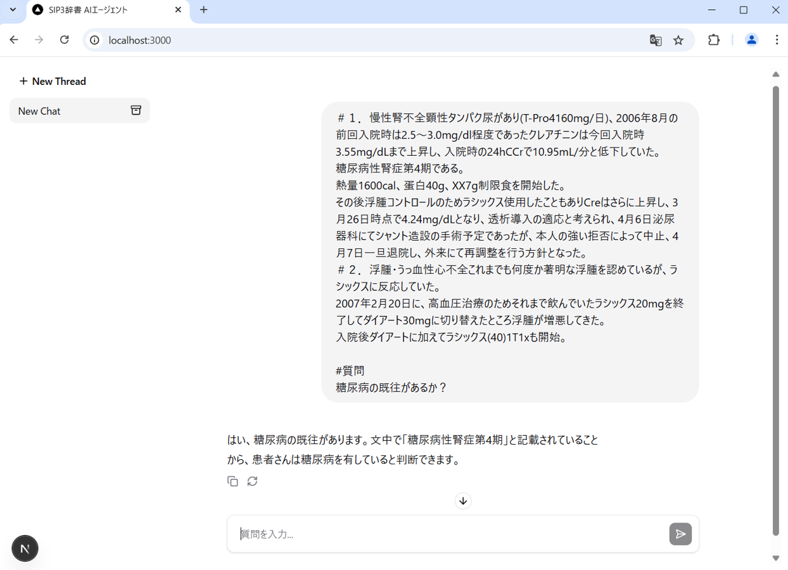

# SIP3-agent



SIP3 辞書を活用して医療文書を解析する AI エージェントです。  
現在は、SIP3 辞書 API で文書を解析してから質問に回答するという処理に固定されています。  
ローカル LLM で動作します。

構成は以下です。

- mastra: AI エージェント構築ライブラリ
- assistant-ui: チャット画面の UI ライブラリ。Nextjs 使用

## インストール

### LLM のインストールと実行

- [LM Studio](https://lmstudio.ai/)をダウンロード、インストールします。
- LM Studio を立ち上げ、左サイドバーの検索タブ（discover）から、LLM を検索してダウンロードします。
  例えば、`Qwen2.5-14B-Instruct-1M-GGUF`をダウンロードします。Mac の場合、MLX 版（`Qwen2.5-14B-Instruct-MLX-8bit`など）をダウンロードします。
- 左サイドバーの Develop タブへ移動し、`Status Stopped`となっていたら、`Status Start`に変更して LLM サーバーを立ち上げます。
- 画面上部の`Select a Model to load`から、ダウンロードした LLM を指定して読み込みます。

### バックエンド、フロントエンドのインストール

`sip3-agent`ディレクトリで、以下コマンドを実行します。  
`npm`をインストールしていない場合は、あらかじめインストールします。

```
npm install
npm run build
```

npm 11.3.0 で動作確認しています。

### 実行

- `.env.example`ファイルをコピーして、`.env`ファイルを作成します。
- `.env`ファイルに環境変数を設定します。  
  現在、OpenAI は使用していないため、`OPENAI_API_KEY`はそのままで良いです。
  以下の `LLM`という変数に`qwen2.5-14b-1m`のような LLM 名を指定します。

```
LLM=qwen2.5-14b-1m
```

以下のコマンドで、AI エージェントとチャット画面を立ち上げます。

```
npm run start
```

ブラウザで、`http://localhost:3000`へアクセスすると、チャット画面が表示されます。
